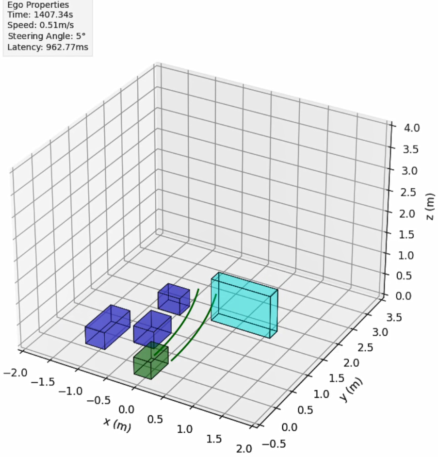
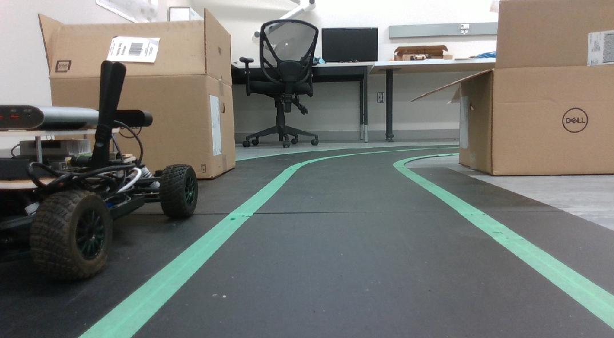
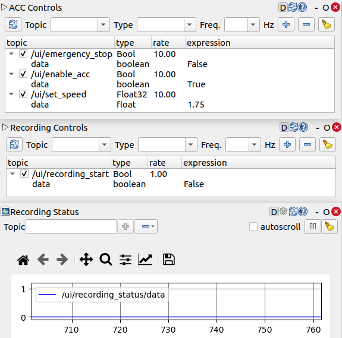
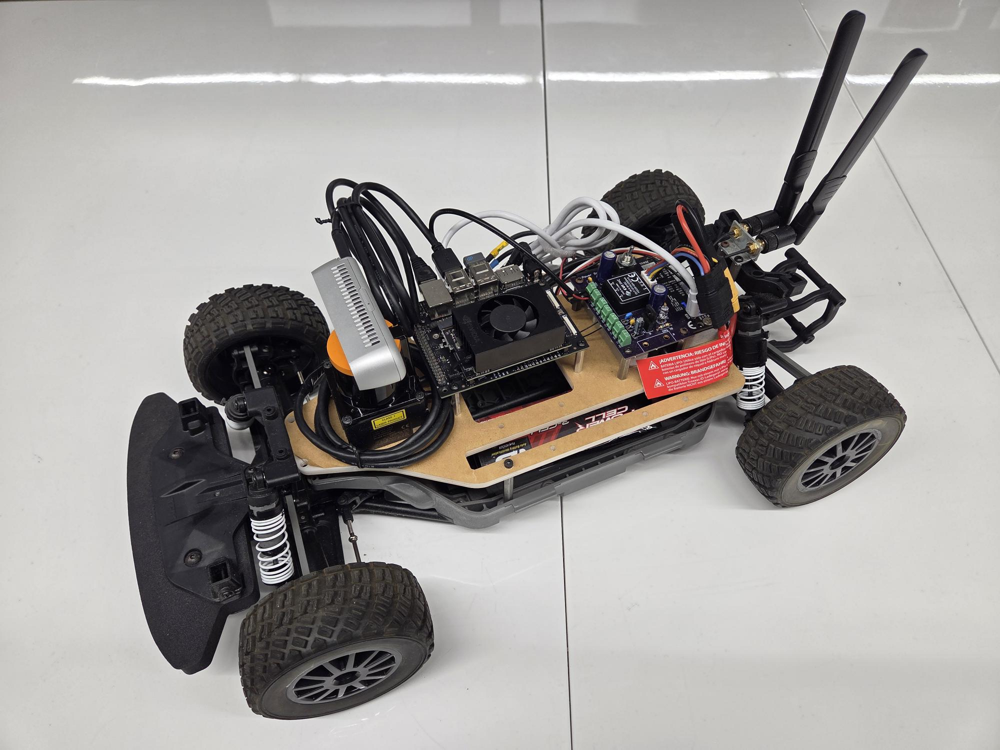

# Automotive Digital Twin based on ISO 23247 Reference Architecture
This repository contains the technical artifacts of a case study on engineering a digital twin (DT) for adaptive cruise control (ACC) in autonomous vehicles (AV). The aim of the case study is to evaluate the suitability of the ISO 23247 reference architecture in automotive settings.
The [RoboRacer](https://roboracer.ai/) (formerly F1Tenth) stack serves as the physical twin.
[ROS](https://www.ros.org/) packages with a `_fe` suffix correspond to the respective functional entity (FE) from the ISO 23247 reference architecture.

The corresponding publication, **Engineering Automotive Digital Twins On Standardized Architectures: How Far Are We?**, is under review for the [2nd International Conference on Engineering Digital Twins (EDTconf 2025)](https://conf.researchr.org/home/edtconf-2025).

## Functionality
The implemented DT extends the functionality of ACC by providing the following:
- Data Monitoring: provides a virtual cockpit to the user
- Remote Management: allows high-level control of ACC remotely through a control panel
- Computation Offloading: the ACC computations are offloaded from the vehicle to the DT for stronger compute resources

### Virtual Cockpit
3D visualization and the corresponding on-board camera stream:

  
  

Control panel:

  

## Physical Vehicle Setup
The 1/10 scale vehicle is developed following the build provided by [RoboRacer](https://roboracer.ai/build).  

  

## Development Environment
The project is developed and tested using the following software environments:
- Ubuntu 20.04
- ROS2 Foxy
- Nvidia Jetson JetPack 5.0
- MATLAB R2023a (required only to CodeGen new packages)

To install the remaining dependencies, run the following:  
`rosdep install -i --from-path src --rosdistro foxy`

To build the ROS2 packages:  
`colcon build`

## Usage
The Digital Twin System (DTS) runs on three separate devices (PT Entity, DT Entity, and User Entity) connected to the same local Wi-Fi network.  

### PT Entity (Vehicle) Setup
Ensure that the f1thenth_system is set up and functional, as described in the [RoboRacer Driver Stack Setup](https://f1tenth.readthedocs.io/en/foxy_test/getting_started/firmware/drive_workspace.html#roboracer-driver-stack-setup).  

### Network Setup
To establish communication between the three devices, note down the IP addresses of all three devices.  
In `src/communication_fe/config/params.yaml`, update the `ip` fields with the correct IP addresses, as indicated by the comments.  

### Running
On the PT Entity in the f1tenth_system workspace, run:  
`ros2 launch f1tenth_stack bringup_launch.py`

On the PT Entity in this repo, run:  
`ros2 launch launchers pt_entity_launch.py`  

On the DT Entity, run:  
`ros2 launch launchers dt_entity_launch.py`  

On the User Entity, run:  
`ros2 launch launchers user_entity_launch.py`  

### Running on < 3 Devices
A single device can also host multiple entities.  
To do so, replace the appropriate IP address with `127.0.0.1`.  

## Future Work
The on-board camera stream is currently not properly integrated with the User Entity due to bandwidth considerations. 
Future development will be conducted to compress and transmit it to the User Entity without incurring a significant latency increase.  

## Troubleshooting
**Problem Description**: communication_fe package is not found when running/launching, even though it builds, environment is sourced, and all other packages are available.  
**Solution**: manually add the path to the AMENT_PREFIX_PATH environment variable.  
`export AMENT_PREFIX_PATH="$AMENT_PREFIX_PATH:/path/to/repo/install/communication_fe`

## Acknowledgements
The authors would like to thank [McMaster's Centre for Software Certification (McSCert)](https://www.mcscert.ca/) team for their expertise and the RoboRacer hardware. 
The authors would also like to thank the maintainers of [RoboRacer](https://roboracer.ai/) for an excellent 1/10 scale vehicle testbed.  

## License
This repository is released under the Apache 2.0 license as found in the [LICENSE](LICENSE) file.
